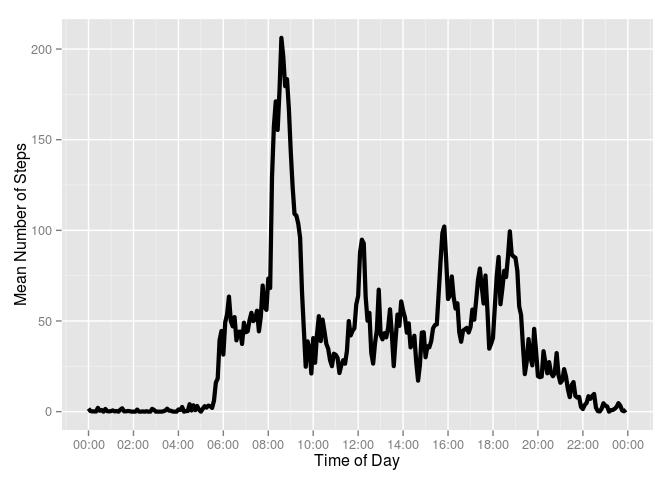

# Reproducible Research: Peer Assessment 1

## Introduction
Personal activity monitoring devices allow for the collection of large amounts
of data about personal movement and physical activity. These measurements can
be used to improve a person's health and to find behaviour patterns.

In this assignment I'll analyse data from a personal activity monitoring device.
This device collects data at 5 minute intervals throughout the day. The data
consists of two months of data from an anonymous individual collected during the
months of October and November, 2012 and include the number of steps taken in 5
minute intervals each day.


## Loading and preprocessing the data
Data for the assignment is provided in the form of a zipped CSV format file. The
following code block unzips the data file (if necessary) and loads the data into
a data frame.


```r
if (!file.exists("activity.csv")) {
    unzip("activity.zip")
}
df <- read.csv("activity.csv", stringsAsFactors=FALSE)
```

There are three columns of data, with a total of 17568 rows:

| Column name | Class | Description |
|-------------|-------|-------------|
| steps | integer | Number of steps taken in a 5-minute interval. Missing values are coded as NA |
| date | character | The date on which the measurement was taken, in YYYY-MM-DD format |
| interval | integer | Identifier for the 5-minute interval in which the measurement was taken |

I use the `lubridate` package to convert column `date` into a datetime object.


```r
library(lubridate)
df$date <- ymd(df$date)
class(df$date)
```

```
## [1] "POSIXct" "POSIXt"
```


## What is mean total number of steps taken per day?
To answer this question, I'll use the `summarise()` function from the `dplyr`
package to obtain the total number of steps taken per day
(previously grouping the data by date).


```r
library(dplyr)
by_dates <- group_by(df, date)
steps.per.day <- summarise(by_dates, totsteps=sum(steps, na.rm=TRUE))
summary(steps.per.day)
```

```
##       date               totsteps    
##  Min.   :2012-10-01   Min.   :    0  
##  1st Qu.:2012-10-16   1st Qu.: 6778  
##  Median :2012-10-31   Median :10395  
##  Mean   :2012-10-31   Mean   : 9354  
##  3rd Qu.:2012-11-15   3rd Qu.:12811  
##  Max.   :2012-11-30   Max.   :21194
```

Here the mean total number of steps is
9354; however, there are actually 
8 days where the
device records zero steps (note that the minimum of `totsteps` is 0). This could
be because the person did not wear the device on those days (which is more
likely than the person being absolutely still on those dates). If we remove rows
with NA values, we get the following distribution:


```r
library(ggplot2)
by_dates <- group_by(
    filter(df, !is.na(steps)),
    date)
steps.per.day <- summarise(by_dates, totsteps=sum(steps, na.rm=TRUE))

fig1 <- ggplot(steps.per.day, aes(x=totsteps)) + 
    geom_histogram(binwidth=2000, fill="firebrick", alpha=0.8) +
    xlab("Total Number of Steps per Day") +
    ylab(paste("Number of Days"))
print(fig1)
```

 

The mean total number of steps is now
10770 steps.


## What is the average daily activity pattern?
To find the average daily activity pattern I'll use `summarise()` again, but
now grouping by time interval identifier and taking the mean number of steps
(after removing again all rows with NA values in `steps`).


```r
by_interval <- group_by(
    filter(df, !is.na(steps)),
    interval)
mean.steps <- summarise(by_interval, avgsteps=mean(steps))
summary(mean.steps)
```

```
##     interval         avgsteps      
##  Min.   :   0.0   Min.   :  0.000  
##  1st Qu.: 588.8   1st Qu.:  2.486  
##  Median :1177.5   Median : 34.113  
##  Mean   :1177.5   Mean   : 37.383  
##  3rd Qu.:1766.2   3rd Qu.: 52.835  
##  Max.   :2355.0   Max.   :206.170
```

To plot the results as a time series, I'll convert the identifier label (which I
assume is the time of day in hours and minutes, in 24hr format) to a datetime
object. Function `scale_x_datetime()` controls the x-axis format (using 
`date_breaks()` and `date_format()` from the `scales` package.)


```r
library(scales)
mean.steps$interval <- hm(format(strptime(sprintf("%04d", mean.steps$interval),
                                          format="%H%M"),
                                 format = "%H:%M"))
fig2 <- ggplot(mean.steps, aes(x=ymd_hms("20150101 00:00:00")+interval,
                               y=avgsteps)) +
    geom_line(size=1.5) +
    xlab("Time of Day") +
    scale_x_datetime(breaks=date_breaks("2 hours"),
                     labels=date_format("%H:%M")) + 
    ylab("Mean Number of Steps") 
print(fig2)
```

 

The maximum average number of steps
(206.20 steps) occurs at
8H 35M 0S.

## Imputing missing values


## Are there differences in activity patterns between weekdays and weekends?
