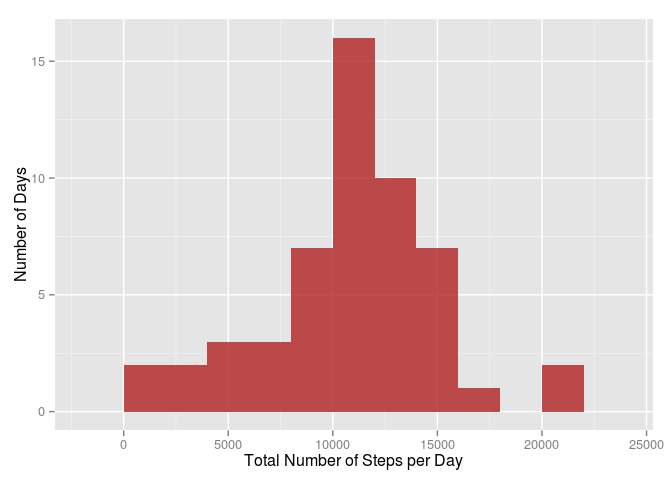

# Reproducible Research: Peer Assessment 1

## Introduction
Personal activity monitoring devices allow for the collection of large amounts
of data about personal movement and physical activity. These measurements can
be used to improve a person's health and to find behaviour patterns.

In this assignment I'll analyse data from a personal activity monitoring device.
This device collects data at 5 minute intervals throughout the day. The data
consists of two months of data from an anonymous individual collected during the
months of October and November, 2012 and include the number of steps taken in 5
minute intervals each day.


## Loading and preprocessing the data
Data for the assignment is provided in the form of a zipped CSV format file. The
following code block unzips the data file (if necessary) and loads the data into
a data frame.


```r
if (!file.exists("activity.csv")) {
    unzip("activity.zip")
}
df <- read.csv("activity.csv", stringsAsFactors=FALSE)
```

There are three columns of data, with a total of 17568 rows:

| Column name | Class | Description |
|-------------|-------|-------------|
| steps | integer | Number of steps taken in a 5-minute interval. Missing values are coded as NA |
| date | character | The date on which the measurement was taken, in YYYY-MM-DD format |
| interval | integer | Identifier for the 5-minute interval in which the measurement was taken |

I use the `lubridate` package to convert column `date` into a datetime object.


```r
library(lubridate)
df$date <- ymd(df$date)
summary(df)
```

```
##      steps             date               interval     
##  Min.   :  0.00   Min.   :2012-10-01   Min.   :   0.0  
##  1st Qu.:  0.00   1st Qu.:2012-10-16   1st Qu.: 588.8  
##  Median :  0.00   Median :2012-10-31   Median :1177.5  
##  Mean   : 37.38   Mean   :2012-10-31   Mean   :1177.5  
##  3rd Qu.: 12.00   3rd Qu.:2012-11-15   3rd Qu.:1766.2  
##  Max.   :806.00   Max.   :2012-11-30   Max.   :2355.0  
##  NA's   :2304
```


## What is mean total number of steps taken per day?
To answer this question, I'll use the `summarise()` function from the `dplyr`
package to obtain the total number of steps taken per day
(previously grouping the data by date).


```r
library(dplyr)
by_dates <- group_by(df, date)
steps.per.day <- summarise(by_dates, totsteps=sum(steps, na.rm=TRUE))
summary(steps.per.day)
```

```
##       date               totsteps    
##  Min.   :2012-10-01   Min.   :    0  
##  1st Qu.:2012-10-16   1st Qu.: 6778  
##  Median :2012-10-31   Median :10395  
##  Mean   :2012-10-31   Mean   : 9354  
##  3rd Qu.:2012-11-15   3rd Qu.:12811  
##  Max.   :2012-11-30   Max.   :21194
```

Here the mean total number of steps is
9354; however, there are actually 
8 days where the
device records zero steps (note that the minimum of `totsteps` is 0). This could
be because the person did not wear the device on those days (which is more
likely than the person being absolutely still on those dates). If we remove rows
with NA values, we get the following distribution:


```r
library(ggplot2)
by_dates <- group_by(
    filter(df, !is.na(steps)),
    date)
steps.per.day <- summarise(by_dates, totsteps=sum(steps, na.rm=TRUE))

fig1 <- ggplot(steps.per.day, aes(x=totsteps)) + 
    geom_histogram(binwidth=2000, fill="firebrick", alpha=0.8) +
    xlab("Total Number of Steps per Day") +
    ylab(paste("Number of Days"))
print(fig1)
```

 

The mean total number of steps is now
10770 steps, and the 
median is 10760 steps.


## What is the average daily activity pattern?
To find the average daily activity pattern I'll use `summarise()` again, but
now grouping by time interval identifier and taking the mean number of steps
(after removing again all rows with NA values in `steps`).


```r
by_interval <- group_by(
    filter(df, !is.na(steps)),
    interval)
mean.steps <- summarise(by_interval, avgsteps=mean(steps))
summary(mean.steps)
```

```
##     interval         avgsteps      
##  Min.   :   0.0   Min.   :  0.000  
##  1st Qu.: 588.8   1st Qu.:  2.486  
##  Median :1177.5   Median : 34.113  
##  Mean   :1177.5   Mean   : 37.383  
##  3rd Qu.:1766.2   3rd Qu.: 52.835  
##  Max.   :2355.0   Max.   :206.170
```

To plot the results as a time series, I'll convert the identifier label (which I
assume is the time of day in hours and minutes, in 24hr format) to a datetime
object. Function `scale_x_datetime()` controls the x-axis format (using 
`date_breaks()` and `date_format()` from the `scales` package.)


```r
library(scales)
mean.steps$timeofday <- hm(format(strptime(sprintf("%04d", mean.steps$interval),
                                          format="%H%M"),
                                 format = "%H:%M"))
fig2 <- ggplot(mean.steps, aes(x=ymd_hms("20150101 00:00:00")+timeofday,
                               y=avgsteps)) +
    geom_line(size=1.5) +
    xlab("Time of Day") +
    scale_x_datetime(breaks=date_breaks("2 hours"),
                     labels=date_format("%H:%M")) + 
    ylab("Mean Number of Steps") 
print(fig2)
```

 

The maximum average number of steps
(206.20 steps) occurs at
835.

## Imputing missing values
As noted before, there are a number of rows with NA values in the data. These
missing data may introduce bias in summaries or calculations. First we find the
total number of rows which contain missing data. From the summary that I printed
after loading the data at the start, I know that missing entries only occur in
the `steps` column.


```r
num.missing <- dim(df[is.na(df$steps),])[1]
num.missing
```

```
## [1] 2304
```

That is, 13.1 per cent of the rows
contain missing data. This is a non-negligible percentage so I'll replace rows
with missing data with the mean value for that time interval (after recording
which rows originally had missing data, so as to be able to revert the changes
should I need to). The corrected data is stored in a new data frame.


```r
dfnew <- df
dfnew$wasMissing <- is.na(dfnew$steps)

dfnew$steps[is.na(dfnew$steps)] <- sapply(
    dfnew$interval[is.na(dfnew$steps)],
    function(x) { mean.steps$avgsteps[mean.steps$interval==x] })
```

Let's look at a summary of the data we added:


```r
summary(filter(dfnew, wasMissing==TRUE)$steps)
```

```
##    Min. 1st Qu.  Median    Mean 3rd Qu.    Max. 
##   0.000   2.486  34.110  37.380  52.830 206.200
```

Now I calculate again the histogram of the number of steps, and the mean and
median:

```r
by_dates <- group_by(dfnew, date)
steps.per.day.new <- summarise(by_dates, totsteps=sum(steps, na.rm=TRUE))
summary(steps.per.day.new)
```

```
##       date               totsteps    
##  Min.   :2012-10-01   Min.   :   41  
##  1st Qu.:2012-10-16   1st Qu.: 9819  
##  Median :2012-10-31   Median :10766  
##  Mean   :2012-10-31   Mean   :10766  
##  3rd Qu.:2012-11-15   3rd Qu.:12811  
##  Max.   :2012-11-30   Max.   :21194
```

```r
fig3 <- ggplot(steps.per.day.new, aes(x=totsteps)) + 
    geom_histogram(binwidth=2000, fill="firebrick", alpha=0.8) +
    xlab("Total Number of Steps per Day") +
    ylab(paste("Number of Days"))
print(fig3)
```

 

The mean total number of steps for the corrected dataset is
10770 steps, and the 
median is 10770
steps. Correcting the data only seems to have a minor effect (the mean is the
same as before, and the median changed by a minor percentage and now matches the
value of the mean).


## Are there differences in activity patterns between weekdays and weekends?
